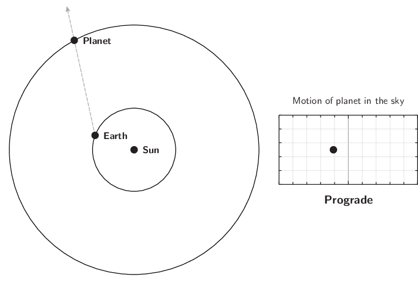

## 2026-07-06
Goal: Set up the repository skeleton + get 3I/ATLAS astrometry 
Did: created repository structure, installed all necessary packages, listed in requirements.txt, imported 3I/ATLAS data and normalized it, as well as creating real timestamps, 
Next: plot sky track (RA vs Dec) and observations-per-week; install find_orb for first orbit fit.

9:45 AM: Got 3I/ATLAS observational data, stored in the file "3I_ATLAS_obs.txt" from https://data.minorplanetcenter.net/explorer/?tab=Designated&search=3I&subtab=Observations (the minor planet center).

10:39 AM: There was an issue with an assumption I made within the dataset, which I found out by comparing raw lines. The dates for 30 entries started with S, depending on if they were from a space telescope, causing difficulties with timestamp formation. Essentially, it was put right before the date, shifting everything over one, and messing up the program I had previously wrote. TTo fix this, I made the parser detect the shift, and account for it through determing if the character at index 15 is a digit (as it should be), and shifting over everything if it wasn't. The culprit rows, however turned out to be observations from TESS, months before 3I/ATLAS was actually discovered.

10:58 AM: Sanity Checks performed, results are the following.
total observations: 8433
First Obs: 2025-05-08 12:25:25.737600. This was 54 days before the July 1 discovery, these were prediscovery detections.
Last Obs:  2026-04-14 23:21:21.801600. Observations spanned about 11 months. 
obscode
C40    245
C23    234
W68    213
T05    207
213    172
958    140
W84    137
323    122
R17    111
R59    110
Name: count, dtype: int64

Note for future comparing: The top observatory codes are not the same ones super common in the isolated tracklet file, compare once the ITF data is used.

AI(Claude) used as a tutor this session, explained a lot of gitHub's functions, helped diagnose bugs, but all code typed and understood by me.

Commit Hashes up to the current point (earliest to latest): 
816e859
ee952c5

## 2026-07-07
Goal: Visualize 3I/ATLAS's skypath and observation timing/frequency from yesterday's table, and attempt to get my first real orbit solution (a target of an eccencrity of ~6.14) using Find_Orb.
Did: Visualized 3I/ATLAS's skypath, found outliers from non-earth observatories
Next: get first real orbit solution.

9:28 AM: I encountered an issue when trying to plot the 3I/ATLAS data, as I had apparently forgotten to ever convert the RA and Dec text into decimals, so I have to go back and write that code. 
    Here's what I wrote: 
    #This column will turn the RA and the Dec into degrees, so they're usable for plotting this data
    from astropy.coordinates import SkyCoord #pulls in skyCoord, which is a tool astropy has for representing sky positions
    import astropy.units as u #pulling in astropy's system for units (degrees, hours, etc.)

    coords = SkyCoord(df["ra_str"], df["dec_str"], unit=(u.hourangle, u.deg)) #feeds the entire RA and Dec columns to SkyCoord at once, and the unit tells it that RA text is in the format of hours-minutes-seconds, while Dec text is in the format of degrees-minutes-seconds
    df["ra_deg"] = coords.ra.deg #Creates a new column labeled ra_deg in my table, that contains each RA value now as degrees
    df["dec_deg"] = coords.dec.deg #Creates a new column labeled dec_deg in my table, that contains each Dec value now as degrees
    df.head() #prints the first five rows, to view the new columns 

    This brought about another issue though, as this still got messed up when the row has an s at the start. Still, like before, Instead of removing these lines from the dataset, which would be the easy way out, I decided not to, because It will/would be helpful for Find_Orb later today, as they're only noise for this plotting, not for the orbit fitting.

    Instead, I created the following "validator cell," to check the data before each individual line gets caught in the next two cells:
    #This is a validator cell, to ensure that every weird line gets caught before going to the next few cells
    looks_ok = df["ra_str"].str.match(r"^\d{2} \d{2} \d{2}") #this line tests every entry in the ra_str column against a pattern, only passing lines that pass the pattern, testing each invididual row. The pattern itself checks to ensure that starting at the very beginning of the string, there are exactly 3 pairs of two digits seperated by spaces.
    print((~looks_ok).sum(), "suspicious rows") #the ~ means not, and flips every true to false and visa versa, so looks ok then marks the rows that failed the test, so we know how many failed without creating a new variable. .sum simply counts how many of these failures there are, and the print tells me the quantity
    df[~looks_ok].head() #This line prints out the first five rows that didn't pass the test.

    Regardless, This was apparently unecessary, as It printed out that there were 0 "suspicious" cells, and the rest functioned fine, But... When I apply this to larger datasets, similar "validator" cells will likely be very useful

    After I got everything else working, I was able to successfully Create a graph that visualized 3I/Atlas's Skypath over time, through degrees in the sky. It is visible in the figures folder, with the name 3I_Atlas_skypath_v1.png

    Commit Hash To This Point: e5eeba1

10:28 AM: After analyzing this skymap, I discovered many very interesting things. One of them is a gigantic gap in the otherwise contionous S-curve. When I look at the time when this was at, I realize it was because that was the time at which 3I/ATLAS went behind the sun, so observations were obviously impossible. Additionally, I noticed about half a dozen outlying datapoints. This is very interesting, because it means that within MPC's own data, there were observations from observatories that were accidentally attributed to 3I/ATLAS, even when it was impossible for them to have been. So, I decided to build a V2 skymap, where these outliers were red (after determind which ones they were, so I could know which telescope they were from, and learn more about it.) Additionally, I wanted to invert the X-axis to standardize this graph further with the norm in this field.

    For this, what I did is I wrote a "true/false" mask, using a similar pattern to what I used for my validator, as shown in the following: 
    #This cell will be a true/False mask, with the same pattern as the validator I built earlier
    outliers = (df["dec_deg"] > 25) | (df["ra_deg"] > 320) #This lists two conditions, that either the Dec was above 25, or the RA was above 320, joined by or, thresholds coming from simply eyeballing the graph, as no legitemente data should be in this area at all. Note: outliers is in true/false form per row
    print(outliers.sum(), "outliers") #counts the quantity of outliers and prints them
    df[outliers][["time", "ra_deg", "dec_deg", "obscode"]] #this line shows the flagged rows, but only the four columns I care about from those rows, so I can see exactly when they happened and who subimmited them. 
    
    I then used this to find that there were a total of 8 outliers. Now, this is imperfect, because I mainly just eyeballed it, but only one other dot was visible, not in a cluster, so We can just assume 9. The rows and info about them are the following:
    	    time	                    ra_deg	    dec_deg     obscode
    3930	2025-09-08 23:43:23.030400	188.611850	34.736217	338
    4106	2025-09-15 00:07:33.686400	333.638662	-1.479956	336
    4145	2025-09-16 00:07:33.772800	334.350579	-1.142406	336
    4160	2025-09-17 00:07:12.950400	335.077425	-0.797889	336
    4293	2025-10-03 09:18:47.001600	221.725629	35.649417	339
    4294	2025-10-03 09:19:16.982400	221.719638	35.651008	339
    4295	2025-10-03 09:19:46.963200	221.713496	35.652739	339
    4296	2025-10-03 09:20:16.944000	221.707333	35.654758	339

    I then used this new classifaction of "outliers" to create "good" and "bad" data, which I then implimented into my graph to color them red (bar one, which I missed)

    This reveails a plethora of information. For example, the steady motion from obscode 336 and 339 prove that they were likely not just reporting random noise, but misattributing this motion of a different (likely near earth) object to 3I/ATLAS. 
    Scratch that. I then checked what those codes were, and found out that these points were NOT in fact attributed, but actually, these points were from spacecraft not on earth, so of course their positions would be very different.

    AI(Claude) used as a tutor this session, helped me understand a lot, helped diagnose bugs, but all code typed and understood by me.

Commit Hash: bd644a6

## 2026-07-08
Goal: INDEPENDENTLY confirm 3I/ATLAS is interstell, by fitting its orbit from the astrometry I've been working with the last few days, using Find_Orb, and recover e = 6.14
Did: built and fixed pair-preserving subset sampler, diagnosed surprise. Fit orbit using Find_Orb on 862 lines, with e = 6.130, q = 1.3527. (close JPL agreement, ~10^-3 difference). When I look at the residuals , they mostly had a healthy difference, but the non-earth ones had massive differences, on the scale of tens of degrees. They, however were auto rejected by Find_Orb. Derived a hyperbolic excess velocity of ~58.10 km/s on paper, using the vis-viva (using jpl's data, calculated ~58.09 km/s, off ~2.5x10^-2). Derivation calculation photos attached.
Next: Send Mentor emails, refit all for 1I and 2I, create a cadence  histogram for all three, continue reading literature.

9:23 AM: According to JPL's small body database (https://ssd.jpl.nasa.gov/tools/sbdb_lookup.html#/?sstr=3I), the numbers I'm        hunting for are as following:
    e(eccentricity) = 6.141351449317625
    q(perihelion distance, closest point to the sun that a celestial object reaches in its orbit around the sun) = 1.356481057231181 AU

When I used the online version of Find_Orb, at https://www.projectpluto.com/fo.htm, and input the 3I/ATLAS data, I received the following error: Internal Server Error The server encountered an internal error or misconfiguration and was unable to complete your request.
Please contact the server administrator at webmaster@projectpluto.com to inform them of the time this error occurred, and the actions you performed just before this error.
More information about this error may be available in the server error log.
Additionally, a 500 Internal Server Error error was encountered while trying to use an ErrorDocument to handle the request.

I was using the online one though, so I decided to cut down the dataset, with the following code:
#This cell will allow me to cut down the dataset side, to hopefully be able to use Find_Orb on this data
sub = []
for i in range(0, len(lines), 10): #counts by tens, by going to every tenth index
    l = lines [i] #a list of all the lines' indexes that are every 10th
    if len(l) >= 80 and l[14].islower(): #if this program happened to land on a "continuation" line, with a lowercase letter at index 14, it would skip it, as these lines come in pairs, and one wihtout the other is not useful.
        continue
    sub.append(l) #if it passed the test, and does not have a continuation line, it'll keep it in the list
    if i + 1 < len(lines) and len(lines[i+1]) >= 80 and lines[i+1][14].islower(): #will look at the line after the primary one we're observing. If it is a continuation line, we take the line after it with us, because we want the pairs to come together. 
        sub.append(lines[i+1])

open("../data/3I_sub.txt", "w").write("\n".join(sub)) #puts all of the kept lines together with line breaks, and puts them into a new file
print(len(sub), "lines written") #pastes out the number of lines written.

It ended up writing 844 lines, into 3I_sub.txt.
I then put this new smaller dataset into the online version of Find_Orb. It worked, and the results were the following.
e = 6.1298082 (close, off by about -1.15x10^-3)
q = 1.35274889 (closer, only off by about -3.73x10^-4)
These relatively small differences were caused by a few reasons. One is that I only fit about 10% of all of the total data that there was for 3I/ATLAS. Additionally, the "solution" that i'm refrencing may include terms for non-gravatational acceleration, and different data cutoffs.

Then, realizing that my dataset had cut off the lines for almost all of my non-earth datapoints, making it so that I couldn't view their residuals (essentially the difference between where that datapoint said where the object was versus where that object actually was expected to be.) So, I altered this code to make a second file, to find those points' residuals. In doing so, the method I was using (finding if the charachter at index 14 was lowercase) wasn't working, which turns out because these lines were completly standerd, following normal convention, meaning that this file mixed two different layouts for space-based data, because, for these lines line[15] is a digit, so they simply registered as ordinary ground observations. 
Looking more in-depth into these lines, the dates didn't match up with what I had assumed, leading me to check, finding a total of 32 non-earth observations in this dataset of thousands, though only 9 from 336, 338, and 339. This is a great lesson to always actually check the data and not just "eyeball" from figures I make.
After implimenting these changes, here were my results for the dataset creation:
862 lines written
18 spacecraft obs kept (9 are expected)

11:14 AM: Once the observations from the three main space observatories ive been focusing on were in the dataset, and ran through Find_Orb, it auto removed them, and their positons were off by tens of degrees from the arc. Find_Orb placed each observer at mars orbit/dep space, and the geometry then closed. But, they're still 10-100x worse than ground data, regardless of the fact that they're consisent within themselves. 

Next (Potentially later Today): calculate the hyperbolic excess velocity on paper

Commit Hash: 846fed0

10:56 PM: I then calculated hyperbolic excess velocity on paper. Between JPL's data, and mine (not accounting for error bars), there was a difference of about 1.48x10^-2. My work is shown here:

AI (Claude) used as tutor this session; explanations, debugging guidance, and review of my interpretations; all code typed, run, and understood by me, and all data/results derived from primary sources.

Commit Hashes: 42dbee0, c28aa91

## 2026-07-09
Goal: Send Mentor emails, refit all for 1I and 2I, create a cadence  histogram for all three, continue reading literature.
Did: Imported data for 1I and 2I, performed sanity checks on both, and created a skymap for 1I with highlighted datapoints for Hubble. Also calculated hyperbolic excess velocity for 1I
Next: Create skymap for 2I, and calcualte its hyperbolic excess velocity. Then read literature.

Data imported for 1I/'Oumuamua from the MPC, at https://www.minorplanetcenter.net/db_search/show_object?utf8=%E2%9C%93&object_id=1I.

9:36 AM: Code copied over from 3I/ATLAS, and applied to new dataset. Sanity check results are as follows:
    total observations: 214
    first: 2017-10-14 10:32:40.704000
    last:  2018-01-02 11:28:28.531200
    obscode
    250    30
    568    27
    H01    22
    926    16
    309     9
    G37     9
    304     9
    G96     8
    950     8
    K93     8
    Name: count, dtype: int64

10:58 AM: When we look at the skymap, we can see, interestingly that almost all of the final datapoints were from observations from the Hubble space telescope, as at that point, no ground telescopes were able to view it. Additionally, I did the calculations for the hyperbolic excess velocity, and I calculated ~26.405 km/s with JPL's data, but ~26.394 km/s with Find_Orb. There's a difference of ~1.17x10^-2.

Data imported for 2I/Borisov from the MPC, at https://www.minorplanetcenter.net/db_search/show_object?utf8=%E2%9C%93&object_id=2I.

11:15 AM: Performed Sanity Checks for 2I data:
    total observations: 3360
    first: 2018-12-13 11:26:13.920000
    last:  2020-09-30 06:28:26.140800
    obscode
    C53    633
    954    243
    134    169
    A84    114
    585    105
    A77    105
    850    100
    A71     77
    T08     76
    G40     51
    Name: count, dtype: int64

AI (Claude) used as tutor this session; explanations, debugging guidance, and review of my interpretations; all code typed, run, and understood by me, and all data/results derived from primary sources.

Commit Hash: efcf2fb

## 2026-07-10
Goal: Create skymap for 2I, calculate its hyperbolic excess velocity. Read literature.
Did: Created skymap, calculated hyperbolic excess velocity
Next: Read The Interstellar Interlopers

9:21 AM: After looking at the skymap, I found a few space based observations. I found C53 (NEOSSat), and C51 (WISE).

9:25 AM: Because many osbservations were space based, I expected them to be outliers, but, since they were orbiting earth, their positions in the sky actually fit on the line from all of the ground based observatories. I also noticed in the top right there were prediscovery points, points from over 8 months before the majority of observations, proving the potential of my project. Additionally, at the end, there is a loop. this is actually because 2I/Borisov had a very long arc, and the object actually appeared to reverse directions in the sky, because of earth's orbit, in something called a retrograde loop. The following GIF helps explain this.

Here, it shows a planet, but that planet really represents 2I/Borisov here.

9:47 AM: According to Find_Orb, e = 3.3566467, q = 2.00660931. According to JPL, e = 3.356475782676596, q = 2.006520878500843. This means that the difference in eccentricity is ~1.71x10^-4, and the difference in periapsis distance is ~8.84x10^-5.

10:14 AM: After calculating the hyperbolic excess velocity, I got ~32.29 km/s with the numbers from Find_Orb, and ~32.28 km/s from JPL's numbers, and an overall difference of ~3.62x10^-4.

10:32 AM: Created a comparsion table of all three discovered ISOs, in ISO_comparison.md.

AI (Claude) used as tutor this session; explanations, debugging guidance, and review of my interpretations; all code typed, run, and understood by me, and all data/results derived from primary sources.

Commit Hash: ee289a8

## 2026-07-12
Goal: Complete Passthrough 1 and potentially 2 of "The Interstellar Interlopers," schedule email sending to potential mentor.
Did: Scheduled email, complted passthrough 1
Next: Passthrough 2

Commit Hash: ff304b5

## 2026-07-13
Goal: Passthrough 2 on the interstellar interlopers
Did: Got through §4.2
Next: Finish Passthrough 2

Reminder: If no responce, send followup email after ~10 days

## 2026-07-14
Goal: Complete Passthrough 2 on the interstellar interlopers
Did: Completed passthrough 2 on the intersetllar interlopers
Next: First look at ITF

9:00 AM: First mentor email sent, ensure to be prepared for follow up.

12:33 AM: Got really anxious about this project, and a potential null result, but I resolved it by looking at the rubric weights, thinking aobut the byproduct discoveries from the ITF, and thinking about the framing for this project.

8:32 PM: Changed running project name to project INTERLOPER

11:14 PM: As verdicts from when I compared my data to Jewitt and Seligman's "The Interstellar Interlopers," I determind that the consistent ~10^-3 to ~10^-2 differences, much larger than when I compared my data to JPL's. I determine that this was because these values for them were their "pre-entry orbital elements," meaning that these values were from before the object entered and got bent by the sun and planets. 

Commit Hash: a537074

## 2026-07-15
Goal: First look at ITF
Did: Got first look at IFT, parsed first 100k lines, made scaling estimates, created itf.py for future, to take away need for new notebooks.
Next: create test_itf.py

1:10 PM: Pulled the ITF from the following link, which also has places to submit potential identifications: https://www.minorplanetcenter.net/mpcops/documentation/identifications/.

1:23 PM: Imported file into data, then checked how many lines it had; the check came back as 9,354,883 lines, a massive number. Additionally, the file is ~722 MB, and literally cant be opened in the codespace because of its size. I then printed out the first five lines, which are as follows:
    /7239   4C2015 05 23.30928 11 55 25.17 -01 46 36.9          23.7 z1     T09
     /7239   4C2015 05 23.32686 11 55 25.34 -01 46 36.1          23.7 z1     T09
     /7239   4C2015 05 23.34140 11 55 25.49 -01 46 35.4          23.5 z1     T09
     /2050   4C2016 07 12.54696 23 31 53.92 -00 17 11.8          23.1 z1     T09
     /2050   4C2016 07 12.56833 23 31 54.24 -00 17 08.9          22.0 z1     T09
     /2050   4C2016 07 12.58992 23 31 54.57 -00 17 05.7          22.6 z1     T09
            * C2018 11 15.45133123 09 38.88 +19 56 53.7          14.0 g      381
            * C2018 11 15.46506923 18 41.46 +19 31 50.8          13.8 g      381
            * C2018 11 15.46524323 18 48.26 +19 31 31.0          13.6 g      381
     /3469    C2024 09 09.98550 19 12 06.972-26 24 14.38         18.40Vq     303
     /3469    C2024 09 09.99147 19 12 06.933-26 24 12.27         18.95Vq     303
     /3469    C2024 09 09.99595 19 12 06.948-26 24 12.43         18.77Vq     303
     2024S   KB2024 10 09.74553 10 11 36.18 -15 48 55.6          14.5 rZ     Q56
     2024S   KB2024 10 09.75190 10 11 39.03 -15 49 04.4          14.4 rZ     Q56
     2024S   KB2024 10 09.75806 10 11 41.66 -15 49 12.9          14.3 rZ     Q56
     /076k   KB2024 10 11.84637 01 07 09.98 +17 07 14.0          19.7 GX     N94
     /076k   KB2024 10 11.85976 01 07 08.21 +17 07 11.3          20.1 GX     N94
     /076k   KB2024 10 11.87314 01 07 06.58 +17 07 08.7          20.0 GX     N94
     /229P   KB2024 11 19.96255 22 04 04.31 -18 22 42.4          19.4 GV     X03
     /229P   KC2024 11 19.96464 22 04 04.09 -18 22 45.0          19.3 GV     X03
     /229P   KB2024 11 19.97238 22 04 04.86 -18 22 43.2          18.8 GV     X03
     /229P   KC2024 11 19.97447 22 04 04.87 -18 22 43.1          19.6 GV     X03
     /229P   KB2024 11 19.98198 22 04 05.49 -18 22 43.3          19.0 GV     X03
     /229P   KC2024 11 19.98406 22 04 05.49 -18 22 43.5          19.4 GV     X03
     /229P   KB2024 11 19.99158 22 04 06.18 -18 22 43.0          19.0 GV     X03
     /229P   KC2024 11 19.99366 22 04 06.09 -18 22 45.0          19.3 GV     X03
     /0773    C2025 01 03.64755 03 05 15.52 +39 23 19.7          14.8 GV     G26
     /0773    C2025 01 03.66814 03 05 15.58 +39 23 07.3          14.1 GV     G26
     /6899   %C2025 03 01.11491 10 06 46.18 +11 33 14.8          20.9 GX     W76
     /6899   %C2025 03 01.15005 10 06 44.48 +11 33 23.4                X     W76
     /6899   %C2025 03 01.18072 10 06 43.01 +11 33 31.5          20.4 GX     W76
     /351P   3C2025 05 07.31700 20 38 29.26 -32 26 17.3          20.6 TV     X07
     /351P   3C2025 05 07.32043 20 38 29.35 -32 26 17.0                V     X07
     /341P   KC2025 09 02.34844 02 26 53.85 +13 35 56.3          20.8 GX     W62
     /341P   KC2025 09 02.35821 02 26 53.96 +13 35 56.7          20.8 GX     W62
     /341P   KC2025 09 02.36309 02 26 54.03 +13 35 57.0          21.0 GX     W62
     /0430   KC2025 10 17.67516 18 09 25.24 -14 38 59.1          17.0 GV     M31
     /0430   KC2025 10 17.67676 18 09 25.01 -14 38 58.3          17.1 GV     M31
     /0430   KC2025 10 17.67834 18 09 25.80 -14 38 49.7          17.2 GV     M31
     /3520   KB2025 10 26.55452 00 05 49.16 +07 45 49.2          20.4 GX     N94
     /3520   KB2025 10 26.56352 00 05 48.87 +07 45 51.1          15.8 GX     N94
     /3520   KB2025 10 26.57250 00 05 48.41 +07 45 51.8          15.8 GX     N94
     91J02Z * C2007 01 19.31311 07 46 40.63 +26 56 05.7          18.2 Ro     699
     91J02Z   C2007 01 19.33505 07 46 39.31 +26 56 05.5                o     699
     91J02Z   C2007 01 19.35698 07 46 38.16 +26 56 04.2                o     699
     Hall2    C1999 06 05.03484 17 47 47.64 -25 27 24.3          16.6 R      706
     Hall2    C1999 06 05.05588 17 47 46.50 -25 27 26.9          16.9 R      706
     ?        C1995 05 03.87789 13 24 01.20 -08 32 54.0          16.7 R      113
     ?        C1995 05 03.93279 13 24 01.72 -08 33 02.4                      113
     ?????    C2006 04 04.80646 11 27 31.17 +17 07 51.0          19.1 Ro     A94

1:59 PM: Notes about the formatting:
    Date at 15
    Discovery asterisks at 12
    some choordinate lines carrying extra precision (three RA decimals, no space before the Dec sign)
    Missing magnitudes
    File order reflects some intial sorting: distributions from the first 100K lines (observatories, years) will be biased. 

2:03 PM: Created a seperate file witht he first 100k lines, for initial parsing.

2:49 PM: Checked the RAM available, got ~5.6Gi

2:54-4:40 PM: Started practice preparing all this data like I did with 1I, 2I, and 3I, in ../notebooks/0X_itf_firstlook.ipynb

    Note(s): used %%time (cell magic) at the start of every cell to actually time each and every cell

    First Cell: loads the dataset, prints out total number of lines
        100000
        CPU times: user 10.4 ms, sys: 17.4 ms, total: 27.8 ms
        Wall time: 29.5 ms
    Second Cell: allows me to eyeball the raw structure by printing the first 5 lines
        '     /7239   4C2015 05 23.30928 11 55 25.17 -01 46 36.9          23.7 z1     T09'
        '     /7239   4C2015 05 23.32686 11 55 25.34 -01 46 36.1          23.7 z1     T09'
        '     /7239   4C2015 05 23.34140 11 55 25.49 -01 46 35.4          23.5 z1     T09'
        '     /2050   4C2016 07 12.54696 23 31 53.92 -00 17 11.8          23.1 z1     T09'
        '     /2050   4C2016 07 12.56833 23 31 54.24 -00 17 08.9          22.0 z1     T09'
        CPU times: user 814 μs, sys: 0 ns, total: 814 μs
        Wall time: 1.23 ms
    Third Cell: Parses all the data, practically copied over from 3I astrometry notebook, but added a new field for the designation
        97746 parsed | 0 short | 2254 continuation
        CPU times: user 426 ms, sys: 88.6 ms, total: 514 ms
        Wall time: 544 ms
        	desig	date_str	        ra_str	     dec_str	mag_str	obscode
        0	/7239	2015 05 23.30928	11 55 25.17	-01 46 36.9	23.7	T09
        1	/7239	2015 05 23.32686	11 55 25.34	-01 46 36.1	23.7	T09
        2	/7239	2015 05 23.34140	11 55 25.49	-01 46 35.4	23.5	T09
        3	/2050	2016 07 12.54696	23 31 53.92	-00 17 11.8	23.1	T09
        4	/2050	2016 07 12.56833	23 31 54.24	-00 17 08.9	22.0	T09
    Fourth Cell: Measures how many GB of memory all 100k lines have taken
        0.034 GB for 100k lines
        CPU times: user 124 ms, sys: 2.14 ms, total: 126 ms
        Wall time: 280 ms
    Fifth Cell: Will extrapolate based off all the numbers/data i've collected so far, to calculate how long it will take, and how much space it will take up
        projected parse time: 848.2 minutes
        projected dataframe: 3.2 GB
        CPU times: user 445 μs, sys: 0 ns, total: 445 μs
        Wall time: 577 μs

        This dataframe is great, but the expected parse time is frankly massive, and a gigantic issue, as that's just over 14 HOURS.

        Turns out I had forgot to account for the fact that my time values were in microseconds, so I just fixed that up in my input, and got the following result.

        projected parse time: 0.8 minutes
        projected dataframe: 3.2 GB
        CPU times: user 276 μs, sys: 0 ns, total: 276 μs
        Wall time: 259 μs
    Sixth Cell: a census of all the different "flag" types. In the ITF, I expect there to be a lot more than in any of my other datasets, and simply in the first 50 I printed out at the start already showed mupltile, such as C.
        [('C', 95470), ('S', 2254), ('s', 2254), ('B', 16), (' ', 6)]
        CPU times: user 13.3 ms, sys: 813 μs, total: 14.1 ms
        Wall time: 15 ms

        What this reveals is that there were really only 4 different "flags." I also had a unique flag, in that it oftentimes found a blank space at index 14, 6 times.
    Seventh Cell: The validator cell that I coded for 3I, pulled directly from the 3I astrometry notebook, catches "bad" lines before future cells.
        0 suspicious rows
        CPU times: user 59.2 ms, sys: 1.47 ms, total: 60.6 ms
        Wall time: 147 ms

        Somehow found 0 suspicious rows.
    Eighth Cell: structural checks
        desig
        0001198    32
        0003065    30
        0001935    28
        0003154    26
        0000781    23
        0001501    23
        06AQUV     23
        0001508    22
        0000533    21
        0023651    21
        Name: count, dtype: int64
        obscode
        705    81145
        699    10931
        C51     2254
        Z18      846
        568      568
        Z32      468
        608      183
        J75      156
        W92      101
        I41       73
        Name: count, dtype: int64
        45623 distinct designations in file slice
        CPU times: user 57.2 ms, sys: 1.15 ms, total: 58.3 ms
        Wall time: 98.5 ms

        The ITF is structurally single tracklet (with an average ~2.1 observations per designation in this slice), orbit determina here is only possible through cross-night linkage, which is the job of my future pipeline.

Commit Hash: 51aa5fb

5:03 PM: created folder injest in src, the tests folder, and within injest, and the braoder src, __ini__.py, to tell python that this folder contained importable code. 

5:29 PM: Created the module file, with the parser code, so I don't have to create a new .ipynb file for every slice or time I change stuff in the future. I made it so it could fit a broader range of lines and data.

Commit Hash: f1fe82e

## 2026-07-16
Goal: create test_itf.py, verify the parser module against known results, parase all ~9 million lines through it, and produce my first valid census of the ITF
Did: 
Next: 

1:12 PM: Coded test_itf.py, to verify the parser's accuracy

1:21 PM: ran test_itf.py, all tests passed, parser deemed accurate and prepared.

2:02 PM: decided to add continuation line to test_itf.py, to ensure it works, even for shifted lines. I used "grep " s2019" data/2I_Borisov_obs.txt | head -1" in the terminal to find a line from my 2I data that has the "flag" s at the start, a continuation line (different, but common). When I ran it, I got "0002IK19Q040  s2019 09 13.5327581 +   10.2502 + 5112.0801 + 4988.3508   ~01XrC53", which I put in test_itf.py, simply by adding this line, by using another assert, which checked if running the function with this line rejected it. Nothing printed, meaning that the line was rejected, and my parser was successful.

    New First Cell in itf_firstlook:
        imports src, and also auto reloads notebook when I make changes
    Now Tenth Cell:
        Tests the parsing function, and simply ensures that the move didn't change anything. Received the following output:
        {'parsed': 1, 'skipped': 0}
        False : module gives the same answer as cell from tuesday. 
        Turns out that I simply indented the return statement in itf.py one too much. I then got the following output:
        {'parsed': 97746, 'skipped': 2254}
        True : module gives the same answer as cell from tuesday
        This was the exact output that I wanted, meaning the new parser function is working beautifully.
    Eleventh Cell: 
        Should finally parse the whole ~9-million-file. When I ran it for the first time, I received the following error:
        The Kernel crashed while executing code in the current cell or a previous cell. 
        Please review the code in the cell(s) to identify a possible cause of the failure. 
        Click here for more info. 
        View Jupyter log for further details.
        Essentially, the kernel crashed when the entire file was loaded, even though my prediction said that there would only be ~3.2 Gb used. This, however is the final size of the variable, not while it was running, it can't handle that. To fix this, instead of switching to a higher power machine through github, after some research, I discoverd a method called "streaming." This essentially "streams" each line, one at a time, so any size file will take up the same amount of space at a time. I added a new function to itf.py, called census_itf, which will do just this. This works by essentially going through the entire file just once, and creating tally lists of everything. I then commented out this cell, and moved onto other for now.
    Twelth Cell: 
        {'parsed': 9290214, 'skipped': 64669, 'bad_ra': 0}
        [('F51', 2720677), ('W84', 1197169), ('G96', 1085281), ('F52', 1038077), ('T09', 871810), ('V00', 485629), ('705', 462223), ('691', 259477), ('309', 152324), ('703', 127381), ('644', 102570), ('699', 92473), ('568', 72077), ('695', 67819), ('807', 64994)]
        42.2 percent from top two
        1858 3
        1889 1
        1901 1
        1920 6
        1950 2
        1951 6
        1953 14
        1954 12
        1955 14
        1956 8
        1960 6
        1974 2
        1975 2
        1976 8
        1977 2
        1978 12
        1981 18
        1982 13
        983 8
        1984 2
        1985 8
        1986 4
        ...
        2024 566167
        2025 548315
        2026 237383
        2593332 designations | mean 3.58 | median 3.0
        CPU times: user 28.4 s, sys: 1.34 s, total: 29.7 s
        Wall time: 47.7 s
        Additionally, it produced the image, in figures at "itf_tracklet_sizes_V1.png."
        Primary Contributor: Pan-STARRS 1, Haleakala
        Secondary Contributor: Cerro Tololo-DECam
        Tertiary Contributors: Mt. Lemmon Survey, Mauna Kea-UH/Tholen NEO Follow-Up (Subaru), Kitt Peak-Bok
        There are 2,593,332 distinct designations in this file, with a mean of 3.58 observations per designation.
        Additionally, the MPC's format dicipline is IMPECCABLE, because there were a total of 0 malformed RA fields.
        Interestingly, in 1858, there were three observations, from before the lightbulb, while on the other end, 2026 had 237383 by mid July.
        There were also 64,669 skipped, meaning they had lowercase flags, and were from spacecraft (they usually come at least in pairs)

        I then added on more to the code, and got the following info:
        283 (the designation with the most observations)
        [('tnoa002', 283), ('soho181', 269), ('tnoa009', 238), ('RL00TZQ', 221), ('RL00U5M', 218)]

        
