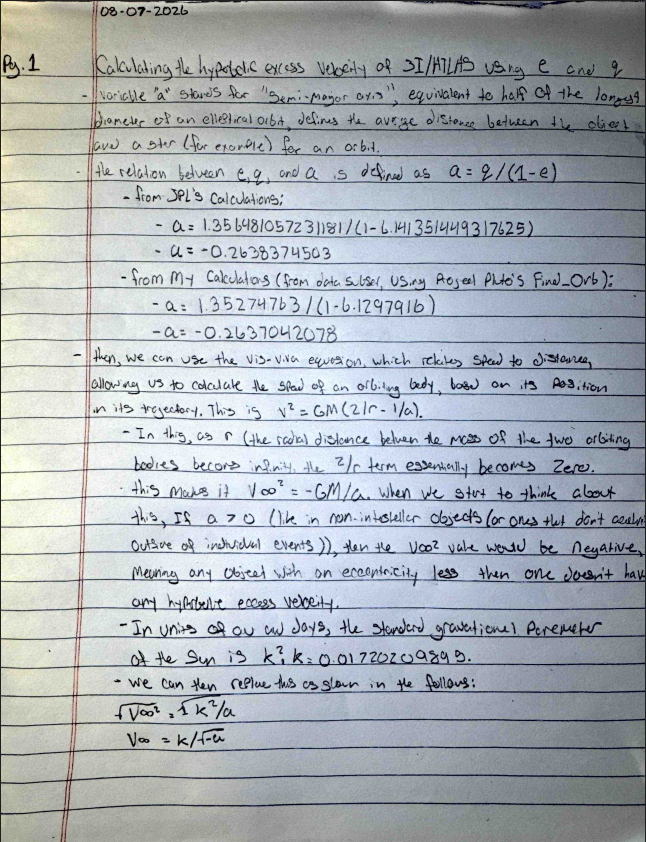
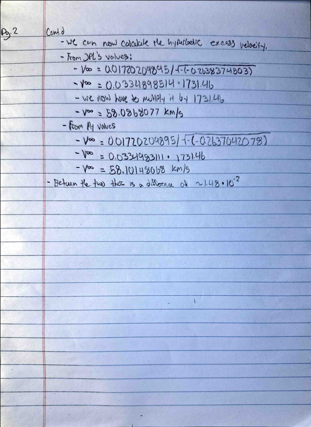

## 2026-07-06
Goal: Set up the repository skeleton + get 3I/ATLAS astrometry 
Did: created repository structure, installed all necessary packages, listed in requirements.txt, imported 3I/ATLAS data and normalized it, as well as creating real timestamps, 
Next: plot sky track (RA vs Dec) and observations-per-week; install find_orb for first orbit fit.

9:45 AM: Got 3I/ATLAS observational data, stored in the file "3I_ATLAS_obs.txt" from https://data.minorplanetcenter.net/explorer/?tab=Designated&search=3I&subtab=Observations (the minor planet center).

10:39 AM: There was an issue with an assumption I made within the dataset, which I found out by comparing raw lines. The dates for 30 entries started with S, depending on if they were from a space telescope, causing difficulties with timestamp formation. Essentially, it was put right before the date, shifting everything over one, and messing up the program I had previously wrote. TTo fix this, I made the parser detect the shift, and account for it through determing if the character at index 15 is a digit (as it should be), and shifting over everything if it wasn't. The culprit rows, however turned out to be observations from TESS, months before 3I/ATLAS was actually discovered.

10:58 AM: Sanity Checks performed, results are the following.
total observations: 8433
First Obs: 2025-05-08 12:25:25.737600. This was 54 days before the July 1 discovery, these were prediscovery detections.
Last Obs:  2026-04-14 23:21:21.801600. Observations spanned about 11 months. 
obscode
C40    245
C23    234
W68    213
T05    207
213    172
958    140
W84    137
323    122
R17    111
R59    110
Name: count, dtype: int64

Note for future comparing: The top observatory codes are not the same ones super common in the isolated tracklet file, compare once the ITF data is used.

AI(Claude) used as a tutor this session, explained a lot of gitHub's functions, helped diagnose bugs, but all code typed and understood by me.

Commit Hashes up to the current point (earliest to latest): 
816e859
ee952c5

## 2026-07-07
Goal: Visualize 3I/ATLAS's skypath and observation timing/frequency from yesterday's table, and attempt to get my first real orbit solution (a target of an eccencrity of ~6.14) using Find_Orb.
Did: Visualized 3I/ATLAS's skypath, found outliers from non-earth observatories
Next: get first real orbit solution.

9:28 AM: I encountered an issue when trying to plot the 3I/ATLAS data, as I had apparently forgotten to ever convert the RA and Dec text into decimals, so I have to go back and write that code. 
    Here's what I wrote: 
    #This column will turn the RA and the Dec into degrees, so they're usable for plotting this data
    from astropy.coordinates import SkyCoord #pulls in skyCoord, which is a tool astropy has for representing sky positions
    import astropy.units as u #pulling in astropy's system for units (degrees, hours, etc.)

    coords = SkyCoord(df["ra_str"], df["dec_str"], unit=(u.hourangle, u.deg)) #feeds the entire RA and Dec columns to SkyCoord at once, and the unit tells it that RA text is in the format of hours-minutes-seconds, while Dec text is in the format of degrees-minutes-seconds
    df["ra_deg"] = coords.ra.deg #Creates a new column labeled ra_deg in my table, that contains each RA value now as degrees
    df["dec_deg"] = coords.dec.deg #Creates a new column labeled dec_deg in my table, that contains each Dec value now as degrees
    df.head() #prints the first five rows, to view the new columns 

    This brought about another issue though, as this still got messed up when the row has an s at the start. Still, like before, Instead of removing these lines from the dataset, which would be the easy way out, I decided not to, because It will/would be helpful for Find_Orb later today, as they're only noise for this plotting, not for the orbit fitting.

    Instead, I created the following "validator cell," to check the data before each individual line gets caught in the next two cells:
    #This is a validator cell, to ensure that every weird line gets caught before going to the next few cells
    looks_ok = df["ra_str"].str.match(r"^\d{2} \d{2} \d{2}") #this line tests every entry in the ra_str column against a pattern, only passing lines that pass the pattern, testing each invididual row. The pattern itself checks to ensure that starting at the very beginning of the string, there are exactly 3 pairs of two digits seperated by spaces.
    print((~looks_ok).sum(), "suspicious rows") #the ~ means not, and flips every true to false and visa versa, so looks ok then marks the rows that failed the test, so we know how many failed without creating a new variable. .sum simply counts how many of these failures there are, and the print tells me the quantity
    df[~looks_ok].head() #This line prints out the first five rows that didn't pass the test.

    Regardless, This was apparently unecessary, as It printed out that there were 0 "suspicious" cells, and the rest functioned fine, But... When I apply this to larger datasets, similar "validator" cells will likely be very useful

    After I got everything else working, I was able to successfully Create a graph that visualized 3I/Atlas's Skypath over time, through degrees in the sky. It is visible in the figures folder, with the name 3I_Atlas_skypath_v1.png

    Commit Hash To This Point: e5eeba1

10:28 AM: After analyzing this skymap, I discovered many very interesting things. One of them is a gigantic gap in the otherwise contionous S-curve. When I look at the time when this was at, I realize it was because that was the time at which 3I/ATLAS went behind the sun, so observations were obviously impossible. Additionally, I noticed about half a dozen outlying datapoints. This is very interesting, because it means that within MPC's own data, there were observations from observatories that were accidentally attributed to 3I/ATLAS, even when it was impossible for them to have been. So, I decided to build a V2 skymap, where these outliers were red (after determind which ones they were, so I could know which telescope they were from, and learn more about it.) Additionally, I wanted to invert the X-axis to standardize this graph further with the norm in this field.

    For this, what I did is I wrote a "true/false" mask, using a similar pattern to what I used for my validator, as shown in the following: 
    #This cell will be a true/False mask, with the same pattern as the validator I built earlier
    outliers = (df["dec_deg"] > 25) | (df["ra_deg"] > 320) #This lists two conditions, that either the Dec was above 25, or the RA was above 320, joined by or, thresholds coming from simply eyeballing the graph, as no legitemente data should be in this area at all. Note: outliers is in true/false form per row
    print(outliers.sum(), "outliers") #counts the quantity of outliers and prints them
    df[outliers][["time", "ra_deg", "dec_deg", "obscode"]] #this line shows the flagged rows, but only the four columns I care about from those rows, so I can see exactly when they happened and who subimmited them. 
    
    I then used this to find that there were a total of 8 outliers. Now, this is imperfect, because I mainly just eyeballed it, but only one other dot was visible, not in a cluster, so We can just assume 9. The rows and info about them are the following:
    	    time	                    ra_deg	    dec_deg     obscode
    3930	2025-09-08 23:43:23.030400	188.611850	34.736217	338
    4106	2025-09-15 00:07:33.686400	333.638662	-1.479956	336
    4145	2025-09-16 00:07:33.772800	334.350579	-1.142406	336
    4160	2025-09-17 00:07:12.950400	335.077425	-0.797889	336
    4293	2025-10-03 09:18:47.001600	221.725629	35.649417	339
    4294	2025-10-03 09:19:16.982400	221.719638	35.651008	339
    4295	2025-10-03 09:19:46.963200	221.713496	35.652739	339
    4296	2025-10-03 09:20:16.944000	221.707333	35.654758	339

    I then used this new classifaction of "outliers" to create "good" and "bad" data, which I then implimented into my graph to color them red (bar one, which I missed)

    This reveails a plethora of information. For example, the steady motion from obscode 336 and 339 prove that they were likely not just reporting random noise, but misattributing this motion of a different (likely near earth) object to 3I/ATLAS. 
    Scratch that. I then checked what those codes were, and found out that these points were NOT in fact attributed, but actually, these points were from spacecraft not on earth, so of course their positions would be very different.

    AI(Claude) used as a tutor this session, helped me understand a lot, helped diagnose bugs, but all code typed and understood by me.

Commit Hash: bd644a6

## 2026-0708
Goal: INDEPENDENTLY confirm 3I/ATLAS is interstell, by fitting its orbit from the astrometry I've been working with the last few days, using Find_Orb, and recover e = 6.14
Did:
Next:

9:23 AM: According to JPL's small body database (https://ssd.jpl.nasa.gov/tools/sbdb_lookup.html#/?sstr=3I), the numbers I'm        hunting for are as following:
    e(eccentricity) = 6.141351449317625
    q(perihelion distance, closest point to the sun that a celestial object reaches in its orbit around the sun) = 1.356481057231181 AU

When I used the online version of Find_Orb, at https://www.projectpluto.com/fo.htm, and input the 3I/ATLAS data, I received the following error: Internal Server Error The server encountered an internal error or misconfiguration and was unable to complete your request.
Please contact the server administrator at webmaster@projectpluto.com to inform them of the time this error occurred, and the actions you performed just before this error.
More information about this error may be available in the server error log.
Additionally, a 500 Internal Server Error error was encountered while trying to use an ErrorDocument to handle the request.

I was using the online one though, so I decided to cut down the dataset, with the following code:
#This cell will allow me to cut down the dataset side, to hopefully be able to use Find_Orb on this data
sub = []
for i in range(0, len(lines), 10): #counts by tens, by going to every tenth index
    l = lines [i] #a list of all the lines' indexes that are every 10th
    if len(l) >= 80 and l[14].islower(): #if this program happened to land on a "continuation" line, with a lowercase letter at index 14, it would skip it, as these lines come in pairs, and one wihtout the other is not useful.
        continue
    sub.append(l) #if it passed the test, and does not have a continuation line, it'll keep it in the list
    if i + 1 < len(lines) and len(lines[i+1]) >= 80 and lines[i+1][14].islower(): #will look at the line after the primary one we're observing. If it is a continuation line, we take the line after it with us, because we want the pairs to come together. 
        sub.append(lines[i+1])

open("../data/3I_sub.txt", "w").write("\n".join(sub)) #puts all of the kept lines together with line breaks, and puts them into a new file
print(len(sub), "lines written") #pastes out the number of lines written.

It ended up writing 844 lines, into 3I_sub.txt.
I then put this new smaller dataset into the online version of Find_Orb. It worked, and the results were the following.
e = 6.1298082 (close, off by about -1.15x10^-3)
q = 1.35274889 (closer, only off by about -3.73x10^-4)
These relatively small differences were caused by a few reasons. One is that I only fit about 10% of all of the total data that there was for 3I/ATLAS. Additionally, the "solution" that i'm refrencing may include terms for non-gravatational acceleration, and different data cutoffs.

Then, realizing that my dataset had cut off the lines for almost all of my non-earth datapoints, making it so that I couldn't view their residuals (essentially the difference between where that datapoint said where the object was versus where that object actually was expected to be.) So, I altered this code to make a second file, to find those points' residuals. In doing so, the method I was using (finding if the charachter at index 14 was lowercase) wasn't working, which turns out because these lines were completly standerd, following normal convention, meaning that this file mixed two different layouts for space-based data, because, for these lines line[15] is a digit, so they simply registered as ordinary ground observations. 
Looking more in-depth into these lines, the dates didn't match up with what I had assumed, leading me to check, finding a total of 32 non-earth observations in this dataset of thousands, though only 9 from 336, 338, and 339. This is a great lesson to always actually check the data and not just "eyeball" from figures I make.
After implimenting these changes, here were my results for the dataset creation:
862 lines written
18 spacecraft obs kept (9 are expected)

11:14 AM: Once the observations from the three main space observatories ive been focusing on were in the dataset, and ran through Find_Orb, it auto removed them, and their positons were off by tens of degrees from the arc. Find_Orb placed each observer at mars orbit/dep space, and the geometry then closed. But, they're still 10-100x worse than ground data, regardless of the fact that they're consisent within themselves. 

Next (Potentially later Today): calculate the hyperbolic excess velocity on paper

Commit Hash: 846fed0

I then calculated hyperbolic excess velocity on paper. Between JPL's data, and mine (not accounting for error bars), there was a difference of about 1.48x10^-2. My work is shown here:

